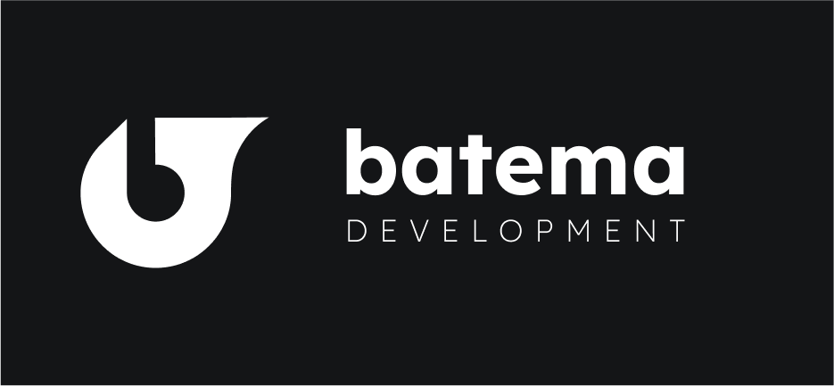

---
<h1 align="center">Lukas Batema</h1>
<h3 align="center">BatemaDevelopment | Keeping Code Public | Established: January 17, 2021</h3>
<h6 align="center">Founder of BatemaDevelopment, and a Jedi Master.</h6>

  

  

  

- 🔭 I’m currently working on **[BatemaDevelopment](https://github.com/lukas-batema/lukas-batema.github.io)**

- 🧑‍🤝‍🧑 I’m looking to collaborate on **Open-Source Projects**

- 👨‍💻 All of my projects are available at [www.batemadevelopment.com](https://www.batemadevelopment.com/)

- 💬 Ask me about **HTML5, JS, and CSS3**

- 📫 How to reach me **lukasbatema@gmail.com**

- ⚡ Fun fact **I have been cubing since 5th grade, and programming since 6th. I am now in 11th grade. Ask me anything in Discussions, for more info about ME!** 

<h3 align="left">Connect with me:</h3>

<h3 align="left">Languages and Tools:</h3>

            

&nbsp;

### Other Things
<table>
  <tr>
    <td>
      
    </td>
  </tr>
</table>

### Recent Activity
<!--START_SECTION:activity-->
1. 🗣 Commented on [#1](https://github.com/blueedgetechno/win11React/issues/1) in [blueedgetechno/win11React](https://github.com/blueedgetechno/win11React)
<!--END_SECTION:activity-->
